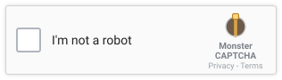

<div align="center">

<a href="https://arumes31.github.io/mon-captcha/">
  
</a>

# Monster CAPTCHA

**A first-person 3D voxel game that proves you're human by making you play, not squint at distorted text.**

[](https://github.com/arumes31/mon-captcha/actions/workflows/ci.yml)
[](https://github.com/arumes31/mon-captcha/actions/workflows/codeql.yml)
[](https://github.com/arumes31/mon-captcha/actions/workflows/docker-ghcr.yml)
[](https://github.com/arumes31/mon-captcha/actions/workflows/pages.yml)
[](https://github.com/arumes31/mon-captcha/pkgs/container/mon-captcha)
[](https://arumes31.github.io/mon-captcha/)
[](LICENSE)

</div>

Catch six capture-points' worth of wandering creatures in a procedurally generated golden-hour valley — swim, wade, spelunk, and throw capture balls Palworld-style — and the CAPTCHA hands your page a token your backend can verify.

---

## Try it

<a href="https://arumes31.github.io/mon-captcha/">
  <picture>
    <source media="(prefers-color-scheme: dark)" srcset="assets/captcha-banner-dark.svg">
    
  </picture>
</a>

☝️ **Click the checkbox.** It opens the real game at
**[arumes31.github.io/mon-captcha](https://arumes31.github.io/mon-captcha/)** — no install, no
sign-up, works on phones. Catch six capture-points' worth of creatures and the HUD flips to
solved. ([diagnostic build](https://arumes31.github.io/mon-captcha/test.html) — same game with a
live panel showing fps, quality tier and capture count.)

> [!NOTE]
> The image above is a still of the control `embed/monster-captcha.js` renders, not the widget
> itself — GitHub strips `<script>` and `<iframe>` from READMEs, so nothing can actually run
> here. The link is the interactive part. The demo runs the game's **direct API** path; the
> full widget flow (`/challenge` → signed token → `/siteverify`) needs `server/verify.mjs`
> running, which a static Pages host can't provide — see
> [Integrating it in your site](#integrating-it-in-your-site).

---

## Table of contents

- [Try it](#try-it)
- [Why](#why)
- [Features](#features)
- [Quick start](#quick-start)
- [Controls](#controls)
- [Integrating it in your site](#integrating-it-in-your-site)
- [Project structure](#project-structure)
- [Performance & compatibility](#performance--compatibility)
- [Testing & CI](#testing--ci)
- [Docker](#docker)
- [Contributing](#contributing)
- [License](#license)

---

## Why

Text/image CAPTCHAs are miserable for humans and increasingly trivial for bots. This is the opposite bet: an experience only a person would bother finishing, wrapped as a drop-in `<script>` with a token callback. No build step, no server-side rendering, no account — one file loads Three.js from a CDN and the rest is procedural.

## Features

**🗺️ A world that's different every load** — seeded terrain (hills, a center lake, baked ambient occlusion) with guaranteed structure: a pond, a flat spawn meadow, a landmark mountain with waterfall + spring basin + magma vent, and a winding wadeable river. Twelve themed biome zones (Sunny Meadow, Ember Flats, Frozen Reaches, Snowfield, Emerald Jungle, Autumn Wood, Mistwater Swamp, Dune Barrens, Rocky Highlands, Fungal Grove, Reed Shores, Alpine Ridge) blend across soft dithered borders, each with its own palette and ambient music mood. Five dynamic weather states (clear, overcast, windy, rain, fog) layer on top.

**🕳️ Caves** — a full underground layer with six distinct theme packs, procedural rock shells, crystal formations, bioluminescent fungi, pools/streams/waterfalls, lantern lighting with god-rays, ambient ear-candy (drips, rumble, footsteps), and its own gameplay hooks (grotto-ball pickups, dead-end corners, cave-ins).

**🐾 51 creature types from 24 voxel body plans** — swimmers patrol the pond and river, true fliers (dragonfly/owl/bat/hummingbird/phoenix) fly real altitude patterns, sizes span tiny (~0.35×) to megafauna (~2.8×). An intelligence layer gives them ball-dodging with readable tells, cover-seeking flight, preferred-range keeping, and same-species alarm calls. 1–2 legendary creatures per world get aura sparkles and a proximity sting.

**🎯 Palworld-style capture flow** — a physics-thrown, tumbling two-tone voxel ball; a hover targeting ring with a live "Capture XX%" readout; tier-based capture rates with a back-strike bonus; suck-in → three wobbles → a golden click, or a panicked breakout. Commons score 1 point, rarer tiers score 2 — six points solves it.

**🎮 Full control parity, desktop and mobile** — WASD/arrows + mouse-look + Space/Ctrl on desktop; on touch devices, an analog virtual joystick, drag-to-look, and dedicated jump/crouch/throw/pause buttons, auto-detected via `matchMedia('(pointer: coarse)')` with zero cost on desktop.

**⚙️ Adaptive performance, including for devices with no real GPU** — three quality tiers (high/medium/low) driving shadow-map size, pixel ratio, post-processing, and level-of-detail radii, stepped live off a rolling FPS sample. A confirmed software rasterizer (SwiftShader, llvmpipe, Windows' Basic Render Driver) is detected up front — before the renderer is even constructed — so it skips antialiasing, uses cheap shadows, and starts at the low tier immediately instead of suffering through a slow ramp-down.

**🔊 A synthesized audio layer** — every sound (throw whoosh, wobble ticks, success chime, breakout burst, capture pop, splash, alarm chirps, legendary sting, looping waterfall, per-zone ambient music, cave reverb) is generated with the Web Audio API. No audio files shipped.

## Quick start

The game is **buildless** — `index.html` loads `main.js` as a native ES module, and Three.js itself resolves from the jsdelivr CDN via an import map. There's nothing to `npm install` or compile for the game itself.

### Option A — any static file server

```bash
python3 -m http.server 8080
# or: npx http-server -p 8080
```

Then open `http://localhost:8080/index.html`.

### Option B — Docker

```bash
docker build -t mon-captcha .
docker run -p 8080:80 mon-captcha
```

### Option C — docker compose

```bash
docker compose up -d --build      # build from the local Dockerfile
# or
docker compose -f docker-compose.ghcr.yml up -d   # pull the published GHCR image instead
```

Either way, visit `http://localhost:8080`.

## Controls

| Action | Desktop | Touch |
| --- | --- | --- |
| Move | `WASD` / Arrow keys | Bottom-left analog joystick |
| Look | Mouse (pointer-locked) | Drag anywhere on the right side of the screen |
| Jump | `Space` | Jump button |
| Crouch | `Ctrl` / `C` (hold) | Crouch button (toggle) |
| Throw capture ball | Click | Throw button |
| Pause | `Esc` (releases pointer lock) | Pause button |

Touch mode is detected automatically — nothing to configure.

## Integrating it in your site

Two ways in. Use the **widget** to put the CAPTCHA on someone else's site; use the **direct API** if you're hosting the game yourself and only need the callback.

### The widget (for third-party sites)

Customer adds two lines:

```html
<form method="POST" action="/signup">
  <input name="email" type="email">

  <div class="monster-captcha"
       data-sitekey="mc_customer-a-com_qTLtf17Ph3D"
       data-verify="https://captcha.yourdomain.com"></div>

  <button type="submit">Sign up</button>
</form>

<script src="https://captcha.yourdomain.com/embed/monster-captcha.js" defer></script>
```

That renders the checkbox pictured in [Try it](#try-it). Clicking it opens the game in a modal
frame; on success the token lands in a hidden `monster-captcha-response` input inside the
surrounding form, and the customer's **backend** verifies it:

```bash
curl -X POST https://captcha.yourdomain.com/siteverify \
  -H 'content-type: application/json' \
  -d '{"secret":"mcs_…","response":"<token from the form>"}'
# => {"success":true,"hostname":"customer-a.com","points":6,"challenge_ts":"…"}
```

Tokens are single-use, expire in two minutes, and are bound to the domain the widget ran on.

#### Where do site keys come from?

You mint them — there's no signup portal and no central registry, because **you** run the
verification service:

```bash
node server/keygen.mjs --origin https://customer-a.com \
                       --origin https://www.customer-a.com \
                       --file server/keys.json
```

```
  sitekey   mc_customer-a-com_qTLtf17Ph3D
      public — goes in the customer's HTML:  data-sitekey="…"

  secret    mcs_A8uckZnc4guGpDsBpNB0Hezak…
      PRIVATE — goes to the customer's BACKEND only, for POST /siteverify.

  origins   https://customer-a.com, https://www.customer-a.com
      tokens for this key are only issued to these embedding sites
```

Then run the service:

```bash
MC_KEYS_FILE=server/keys.json \
MC_CHALLENGE_ORIGINS=https://captcha.yourdomain.com \
node server/verify.mjs
```

**Site keys are domain-restricted.** Before opening the game, the widget calls `/challenge`
from the customer's own page — the browser stamps that request's `Origin`, and page script
can't change it. The server checks it against the key's registered origins and returns a
signed blob naming the domain; the token is minted from *that*, never from anything the
client asserts. Copy a site key onto an unregistered domain and it is refused
(`domain-not-allowed`) before the game even loads.

The limit, stated plainly: `Origin` is a browser guarantee, not a network one — a non-browser
client can send whatever it likes. This stops cross-site and copied-key abuse from real
browsers, which is exactly the guarantee reCAPTCHA/hCaptcha domain restriction gives.

📖 **Full reference: [docs/INTEGRATION.md](docs/INTEGRATION.md)** — all widget attributes, the
JS API, error codes, the postMessage protocol, and the threat model.

### Direct API (self-hosted, no widget)

Drop `index.html`'s `<div id="captcha-container">`/`<div id="hud">` markup and `main.js` into a page. The game exposes a small public API on `window.__captcha`:

```js
window.__captcha = {
  init,                    // (re)start the game
  destroy,                 // tear everything down (call before removing the container)
  getCreaturesCaught,      // current capture-point total
  getIsCaptchaSolved,      // boolean
  getToken,                // in-page token once solved — see the warning below
  getFps,                  // rolling average fps
  getQualityLevel,         // 'high' | 'medium' | 'low'
  isEmbedded,              // running inside a host site's widget frame
};

window.onCaptchaSolved = (token) => { /* … */ };
```

> [!WARNING]
> **`getToken()` is not verifiable.** It returns `SHA-256(nonce:hash:points:required)` where
> the nonce is random and never transmitted, and `CONFIG.PRIVATE_SALT` ships to every browser
> inside `src/config.js` — so it is not a secret, and isn't even used in that hash. A server
> receiving it holds nothing to check it against and cannot tell it from any other 32 bytes
> of hex. Treat it as a UI signal only. For anything that matters, use the widget path above,
> which replaces it with a server-signed token.

See `test.html` for a working reference integration (a live diagnostic panel polling the API),
and `embed/demo.html` for the widget.

## Project structure

```
index.html / test.html    entry pages (test.html adds a diagnostic panel)
main.js                   thin ES module entry point, exposes window.__captcha
style.css                 HUD design system ("Golden Hour Field Guide")

src/
├── game.js               main loop, init/teardown — the composition root
├── engine.js              renderer, camera, sky, lights, controls
├── state.js / config.js   shared mutable state / tunable constants
├── terrain.js             voxel column generation + zone-aware coloring
├── heightfield.js         terrain/river/cave height sampling (pure functions)
├── player.js              first-person movement, jump, crouch, collision
├── touch-controls.js      mobile joystick / drag-look / action buttons
├── gpu-detect.js          proactive software-renderer detection
├── quality.js / lod.js    adaptive quality tiers + distance LOD
├── culling.js             sector-chunked frustum + coarse occlusion culling
├── viewmodel.js           held capture-ball first-person prop
├── ball.js / projectiles.js / capture.js / targeting.js
│                          throw physics, capture-chance rolls, hover UI
├── ui.js                  HUD chip/toast bindings
├── audio.js / music.js    Web Audio synthesizer + ambient zone music
├── particles.js / particle-pool.js
├── atmosphere.js          clouds, fireflies, falling leaves, distant birds
├── lava.js                magma vent + lava river
├── security.js            in-page token (NOT verifiable — see Integrating)
├── embed.js               cross-origin widget bridge (postMessage protocol)
│
├── zones/                 12 biome zone defs + palette/blend lookup
├── mountain/               landmark mountain + waterfall/basin/vent dressing
├── flora/                  trees, bushes, reeds, lily pads, mushrooms, grass
├── weather/                clear/overcast/windy/rain/fog state machine
├── caves/                  the whole underground layer (16 modules: rock
│                            shell, water, crystals, fungi, decor, lighting,
│                            atmosphere, gameplay, audio, theme registry…)
└── creatures/               bestiary, body plans, spawn, behavior/AI, animation

embed/
├── monster-captcha.js     the widget third-party sites include (no deps)
└── demo.html              runnable integration demo

server/
├── verify.mjs             token issuing + /siteverify (node built-ins only)
└── keygen.mjs             mint domain-restricted site key / secret pairs

docs/INTEGRATION.md        full widget reference + threat model
assets/
├── logo.png              brand mark — README header, favicon, portal emblem
└── captcha-banner*.svg   README's clickable widget still (light/dark)

tests/                     Playwright QA harness (dev-only, see tests/README.md)
.github/workflows/         CI, CodeQL, dependency review, GHCR image, Pages demo
Dockerfile, docker-compose*.yml
```

Every module stays under ~700 lines by convention — related concerns get a new file (or, for the larger systems above, a subfolder) rather than growing an existing one.

## Performance & compatibility

- **Adaptive quality**: shadow-map size, pixel ratio, post-processing (bloom), and per-creature level-of-detail all step between `high`/`medium`/`low` based on a rolling FPS sample — no configuration needed.
- **No-GPU devices**: a confirmed software rasterizer is detected before the renderer is even created (`src/gpu-detect.js`), so antialiasing and expensive shadow filtering are skipped from frame one and the quality tier starts at `low` instead of ramping down slowly.
- **Instance budget**: the world is built from InstancedMesh voxels, sector-chunked for real frustum culling, with a worst-case ceiling enforced in CI (`tests/perfbudget.mjs`, `tests/fuzzseed.mjs`).
- Works on any browser with WebGL; a friendly fallback message shows if WebGL is unavailable.

## Testing & CI

The dev-only QA harness lives in [`tests/`](tests/README.md) — Playwright-driven core assertions, an accessibility audit (axe-core), a many-seed invariant sweep, visual regression against committed baselines, and a cross-browser/mobile-device matrix. None of it ships with the game.

Five workflows run in `.github/workflows/`:

| Workflow | What it does |
| --- | --- |
| `ci.yml` | Runs the full `tests/` suite on every push/PR to `main` |
| `codeql.yml` | GitHub CodeQL security scan (JS/TS) |
| `dependency-review.yml` | Flags vulnerable/incompatible new dependencies on PRs |
| `docker-ghcr.yml` | Builds a multi-arch (amd64/arm64) image and pushes it to GHCR on pushes to `main`/version tags |
| `pages.yml` | Publishes the playable demo linked from [Try it](#try-it) to GitHub Pages on pushes to `main` |

`pages.yml` copies the same static files the Dockerfile serves, minus `embed/` and the portal —
both need a server Pages can't run, so publishing them would only ship a demo that fails on
click. Everything the game loads is a relative path, so it works unchanged from the
`/mon-captcha/` subpath.

Dependabot (`.github/dependabot.yml`) keeps `tests/`'s npm deps, the GitHub Actions versions, and the Dockerfile's base image current.

## Docker

`Dockerfile` builds a minimal `nginx:alpine` image serving the static site — there's no compile step, it just copies `index.html`/`test.html`/`main.js`/`style.css`/`src/` into the image. Published automatically to `ghcr.io/arumes31/mon-captcha` by `docker-ghcr.yml`.

Two compose files:
- `docker-compose.yml` — builds locally by default (`docker compose up -d --build`); its `image:` also lets you `docker compose pull` the published tag instead.
- `docker-compose.ghcr.yml` — deployment-only, pulls `ghcr.io/arumes31/mon-captcha:latest` with no local build involved.

## Contributing

No build step means the fastest inner loop is: edit a file under `src/`, refresh the page. Before opening a PR:

```bash
cd tests && npm ci && npx playwright install --with-deps chromium
python3 -m http.server 8347   # in the repo root, separate shell
node itest.mjs && node axe.mjs && node perfbudget.mjs
```

See [`tests/README.md`](tests/README.md) for the full suite and the SwiftShader/headless-Chromium gotchas.

## License

[MIT](LICENSE) © 2026 arumes31 — use it, fork it, ship it commercially; just keep the copyright
notice. The game ships no bundled dependencies (three.js resolves from the jsdelivr CDN at
runtime under its own MIT license), so there is nothing else to attribute.
